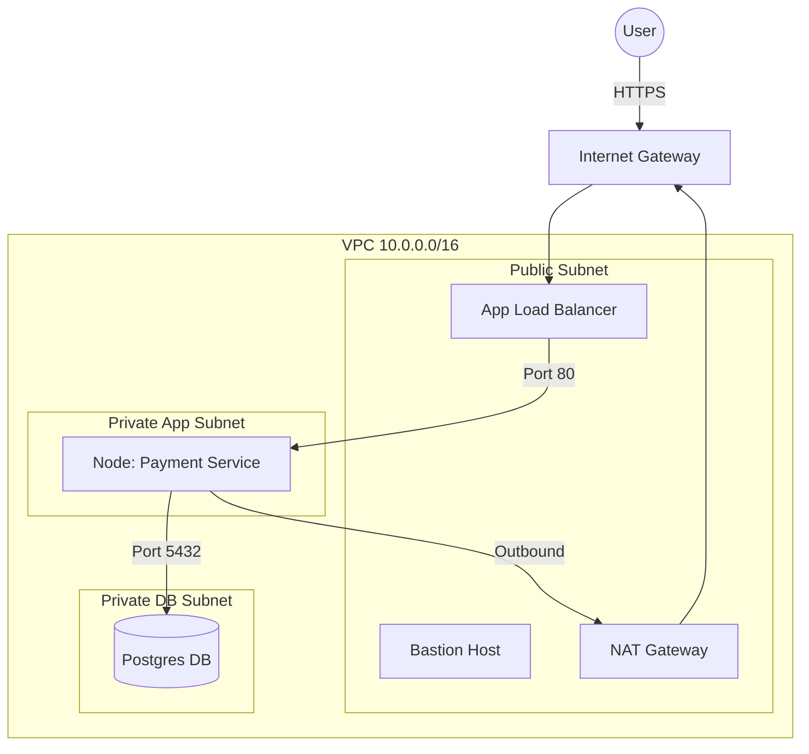

# Phase 5: AWS Cloud Architecture (The Virtual Datacenter)

> **Objective:** Design a production-grade network topology. We DO NOT use the "Default VPC". We build our own house.

## 1. Network Design (VPC & Subnets)
**The Golden Rule:** "Everything is private unless it typically *needs* to be public."

### A. The CIDR Block
*   **VPC CIDR:** `10.0.0.0/16` (65,536 IPs). Plenty of room.
*   *Why 10.x.x.x?* Standard private range (RFC1918).

### B. Subnet Strategy (Multi-AZ)
We need High Availability (HA), so we use **2 Availability Zones (AZs)** (e.g., `us-east-1a`, `us-east-1b`).

| Subnet Name | CIDR | Purpose | Route Table |
| :--- | :--- | :--- | :--- |
| **Public-A** | `10.0.1.0/24` | Load Balancer, Bastion, NAT Gateway | IGW (Internet Gateway) |
| **Public-B** | `10.0.2.0/24` | Load Balancer (Standby) | IGW |
| **Private-App-A** | `10.0.3.0/24` | **Kubernetes Nodes**, EC2 Apps | NAT Gateway (Outbound Only) |
| **Private-App-B** | `10.0.4.0/24` | **Kubernetes Nodes** | NAT Gateway |
| **Private-DB-A** | `10.0.5.0/24` | RDS Database | No Internet Access |
| **Private-DB-B** | `10.0.6.0/24` | RDS Database (Standby) | No Internet Access |

*   **Interview Question:** "Why do your app servers go in Private Subnets?"
*   **Answer:** "Security. They should not be reachable directly from the internet. They only accept traffic from the Load Balancer (in Public) and can only talk to the internet via a NAT Gateway for updates."

## 2. Security Architecture

### A. Security Groups (Stateful Firewalls)
SGs apply to **Instances (EC2/ENI)**.
*   **ALB-SG:** Allow `80/443` from `0.0.0.0/0`.
*   **App-SG:** Allow `5000` **ONLY** from `ALB-SG`. (This is "Chaining").
*   **DB-SG:** Allow `5432` **ONLY** from `App-SG`.
*   **Bastion-SG:** Allow `22` **ONLY** from Corporate VPN IP (or your IP).

### B. NACLs (Stateless Firewalls)
NACLs apply to **Subnets**.
*   *Real World:* Generally kept default (Allow All) unless blocking specific malicious IPs.

### C. IAM (Identity & Access Management)
*   **Never allow `AdministratorAccess`** to an EC2 instance.
*   **Least Privilege:**
    *   If the App needs to read S3, give checks `s3:GetObject` on `Bucket-X` only.
    *   Use **IAM Roles for Service Accounts (IRSA)** in Kubernetes.

## 3. Storage (S3)
*   **Bucket:** `devops-platform-assets`
*   **Encryption:** ENABLED (SSE-S3 or KMS).
*   **Versioning:** ENABLED (To recover from accidental deletes).
*   **Public Access:** BLOCKED ALL.

## 4. Visual Architecture

## 5. Work Execution Plan
We will NOT click buttons in the AWS Console.
In **Phase 6 (Terraform)**, we will write the code to build this EXACT structure.
For now, understand the topology. This is the blueprint.

**Key Takeaway for Interviews:**
"I design networks with a defense-in-depth approach. Public subnets are DMZs only for Load Balancers and NAT Gateways. All compute and data reside in Private subnets with strictly chained Security Groups."
