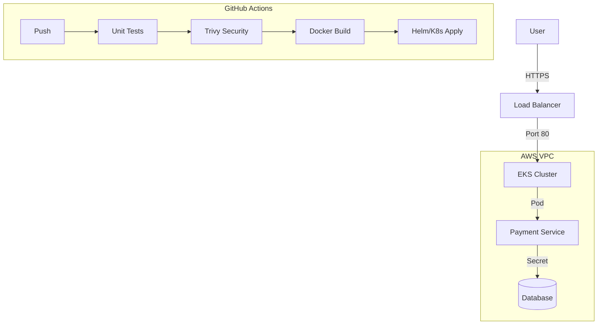

# Enterprise Cloud-Native DevOps Platform

> **A Production-Grade Microservices Platform on AWS with Kubernetes, Terraform, and Ansible.**

## 1. Project Overview
This project simulates a real-world enterprise infrastructure. It deploys a **Python 12-Factor Microservice** to **AWS EKS** using a fully automated **CI/CD Pipeline**.

**Key Features:**
*   **Infrastructure as Code:** 100% Terraform managed (VPC, Subnets, Security Groups).
*   **Container Orchestration:** Kubernetes (EKS) with Self-Healing and Auto-Scaling.
*   **Automation:** Ansible for Post-Provisioning (Bastion Hardening).
*   **Observability:** CloudWatch Dashboards & Alarms for Golden Signals (Latency, Errors).
*   **Security:** DevSecOps pipeline with Trivy vulnerability scanning.

## 2. Architecture



## 3. Tech Stack
| Category | Technology |
| :--- | :--- |
| **Cloud Provider** | AWS (VPC, EC2, EKS, S3, CloudWatch) |
| **IaC** | Terraform (Modular Design) |
| **Configuration** | Ansible (Idempotent Playbooks) |
| **Orchestration** | Kubernetes (Deployment, Service, ConfigMap) |
| **CI/CD** | GitHub Actions |
| **Containerization**| Docker (Multi-stage builds) |
| **Language** | Python (Flask) |

## 4. Directory Structure
```text
devops-platform/
├── application/          # Source Code (Flask + Dockerfile)
├── infrastructure/
│   ├── terraform/        # Infrastructure Provisioning
│   ├── k8s/              # Kubernetes Manifests
│   └── ansible/          # Server Configuration
├── .github/workflows/    # CI/CD Pipelines
└── docs/                 # Architecture & Runbooks
```

## 5. How to Run
### Prerequisites
*   AWS CLI, Terraform, Kubectl, Docker installed.

### Step 1: Provision Infrastructure
```bash
cd infrastructure/terraform/environments/dev
terraform init
terraform apply
```

### Step 2: Configure Servers
```bash
cd infrastructure/ansible
ansible-playbook -i inventory/hosts.ini playbooks/harden_bastion.yml
```

### Step 3: Deploy Application
```bash
kubectl apply -f infrastructure/k8s/
```
